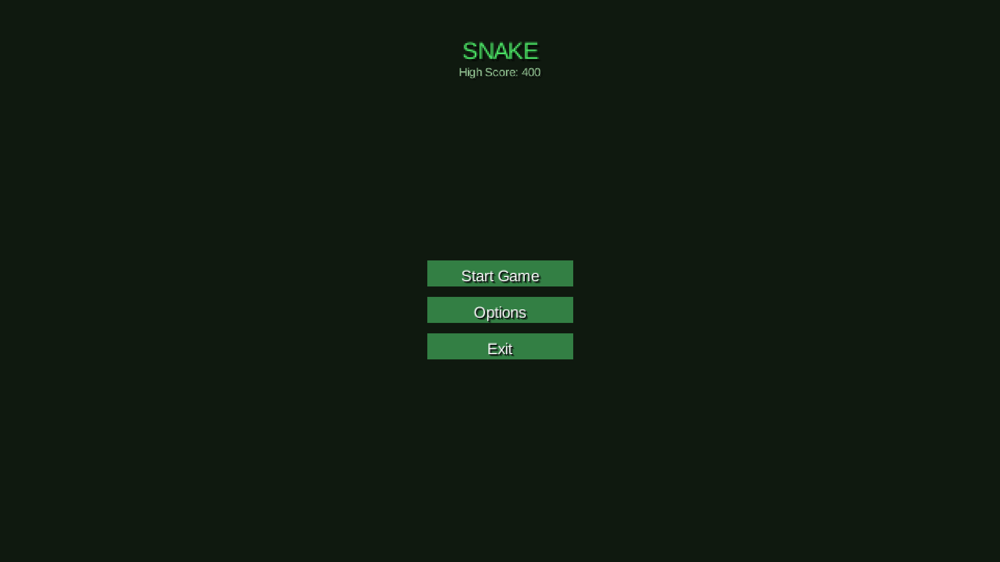
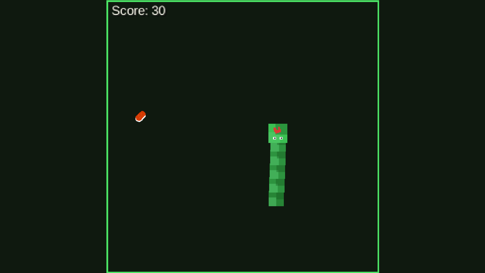
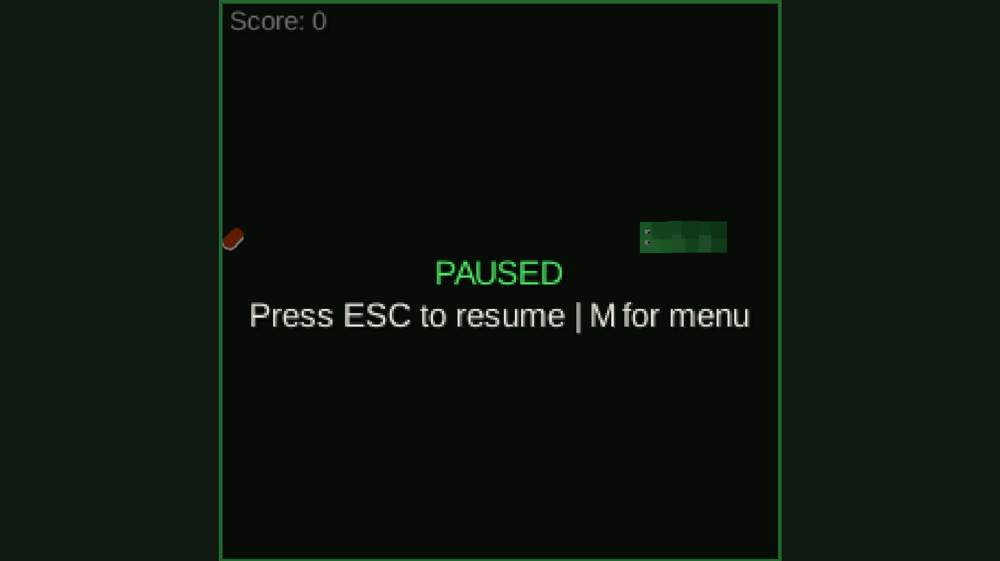
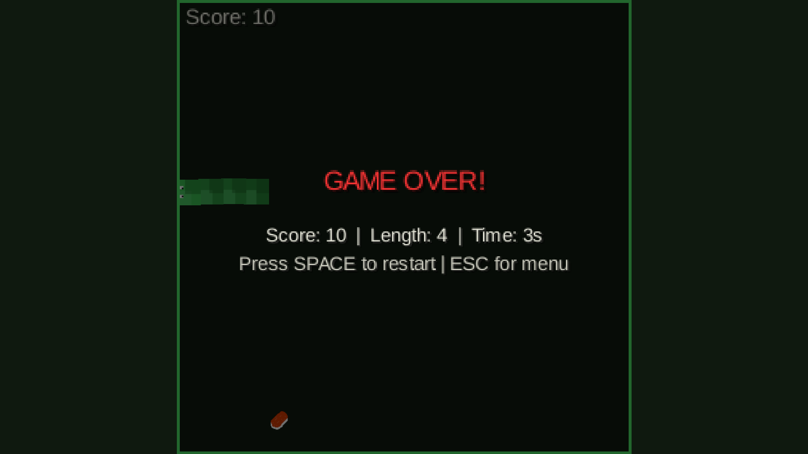

# SnakeJavaGame

A small personal Snake game built in Java using the LibGDX framework.  
It features smooth animations, multiple visual themes, particle effects, and a simple menu/options system, designed as a learning project and a fun little desktop game.

## Screenshots

Main menu:

Options menu:

In‑game (playing):

Pause menu:

Game over:

## Features

- **Smooth movement & animations**
- **Multiple visual themes** (Classic, Neon, Desert)
- **Particle effects** for eating, crashing, and game over
- **Screen shake** for juicy feedback
- **Main menu** with Start, Options, Exit
- **Options screen** with:
  - Windowed / fullscreen mode
  - Multiple window sizes
  - Theme selection
- **High score saving** using LibGDX preferences

## Controls

- **Arrow keys**: Move the snake (Up / Right / Down / Left)
- **ESC** (in game): Pause / open pause menu
- **M** (from pause): Return to main menu
- **SPACE / ENTER** (on game over): Restart
- **ESC** (on game over): Return to main menu

## How to Run

### Requirements

- **Java 21** (or compatible JDK)
- **Maven**
